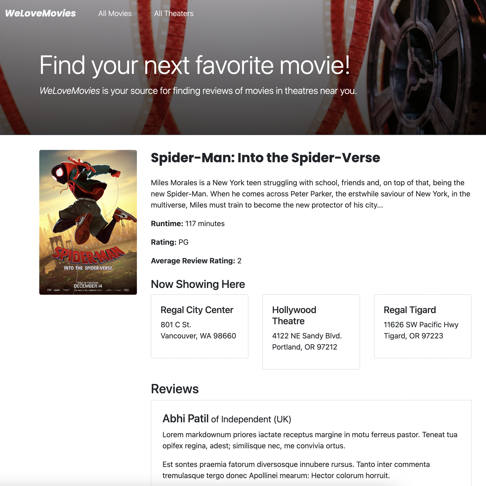

# We-Love-Movies
  
## Description
Looking for great flick near you? The We Love Movies app can help you find your favorite movies in a theather near you! It's a full stack app where you can search for movies currenly showing on theathers. After clicking on a moview, you can choose to either read the plot synopsys and reviews or check out what movie theathers currently run it. This app draws information from a postgreSQL database with mock information. 
          
View the deployed page at [We-Love-Movies](soon).
## Contents
* [Usage](#usage)
   * [Screenshots](#screenshots)
* [Built With](#built-with)
* [Questions](#questions)

## Usage

To run this app locally, two separate terminals must be running simultaniosly. 

In the first terminal:
1. Run "npm i"
1. Change directory to "server"
1. Create a copy of the .env.SAMPLE file and add a link to a PostgreSQL datbase of your choice in the the DATABASE_URL variable.
1.  run "npm run migrate".
1. run "npm start"

In the second terminal:

1. change directory to "client"
1. run "npm start"
  
### Screenshots

## Built With

* HTML
* CSS
* JavaScript
* Node.js
* Express.js
* PostgreSQL
* Knex
* React Js
* Bootsrap
  
## Questions
If you have any questions about the repo, please [open an issue](https://github.com/Oscarlosg/We-Love-Movies/issues) or contact me via email at oscarlosg14@gmail.com. You can find more of my work on my GitHub, [Oscarlosg](https://github.com/Oscarlosg/).
  
